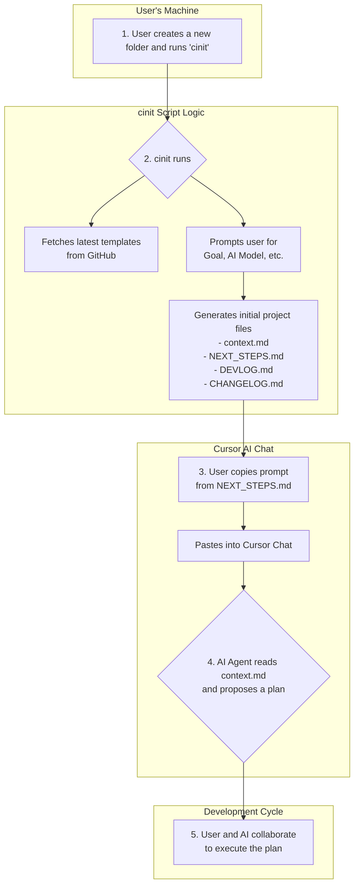

# Cursor Configs

This repository stores and manages the configuration and context files for working with the Cursor AI assistant. The goal is to create a standardized, efficient, and evolving framework for initiating and executing software projects with an AI pair programmer.

## Core Components

1.  **`context_general.md`**: A general context file that outlines the foundational principles, communication styles, and workflows for any project. This serves as the base template.
2.  **Project-Specific Contexts**: (Future) A collection of specialized context files for different types of projects (e.g., `python_api_context.md`, `react_frontend_context.md`).

## The Meta-Workflow

This project is "meta" in that it defines the process for how we define processes. The key idea is that our methods for collaboration should continuously improve. The workflows and context files in this repository are not static; they are expected to be updated as we discover better ways of working together.

### Visual Workflow

The following diagram illustrates the end-to-end workflow, from initializing a new project to starting development with the AI.



## Prerequisites and Recommendations

### Core Requirements

-   **[Git](https://git-scm.com/)**: Required for cloning the repository and for the project initialization workflow.
-   **[Cursor](https://cursor.sh/)**: This entire workflow is designed to be used within the Cursor AI editor.
-   **A compatible shell**:
    -   **Windows**: PowerShell 5.1 or newer.
    -   **Linux / macOS**: A standard shell like `bash` or `zsh`.

### Recommended Tools

-   **[GitHub CLI (`gh`)](https://cli.github.com/)**: For seamless interaction with GitHub repositories from the command line.
-   **Mermaid Diagram Viewer**: To preview the workflow diagram in `README.md` directly within the editor. A popular choice is the **[Markdown Preview Mermaid Support](https://marketplace.visualstudio.com/items?itemName=bierner.markdown-mermaid)** extension available in the Visual Studio Code Marketplace (which is compatible with Cursor).

## Getting Started

This tool supports both Windows and Linux/macOS. Please follow the instructions for your operating system.

### For Windows (PowerShell)

To start using this framework, you need to install the initialization tool. This only needs to be done once per machine.

1.  **Clone this repository**:
    ```powershell
    git clone https://github.com/JasonK94/cursor_configs.git
    ```

2.  **Run the installation script**:
    Open a PowerShell terminal, navigate into the cloned directory, and run the installer.
    ```powershell
    cd cursor_configs
    # You may need to set the execution policy for the current session first
    # Set-ExecutionPolicy -ExecutionPolicy RemoteSigned -Scope Process
    ./scripts/install.ps1
    ```
    This script will set up the `cinit` command for you.

3.  **Restart your terminal** to ensure all changes (like PATH updates) are applied.

### For Linux & macOS (Bash/Zsh)

1.  **Clone this repository**:
    ```bash
    git clone https://github.com/JasonK94/cursor_configs.git
    ```

2.  **Run the installation script**:
    Navigate into the cloned directory and run the installer.
    ```bash
    cd cursor_configs
    sh ./scripts/install.sh
    ```
    This script will create the `cinit` command in `~/.local/bin` and add it to your shell profile (`.bashrc` or `.zshrc`).

3.  **Restart your terminal** or run `source ~/.bashrc` (or `~/.zshrc`) to apply the changes.

### Usage for New Projects (All Operating Systems)

Once the one-time setup is complete, you can initialize any new project with a single command.

1.  Create a new directory for your project and navigate into it.
    ```sh
    mkdir my-new-project
    cd my-new-project
    ```
2.  Initialize a git repository.
    ```sh
    git init
    ```
3.  Run the initialization command:
    ```sh
    cinit
    ```
4.  Follow the interactive prompts. The script will automatically create `context.md`, `NEXT_STEPS.md`, `DEVLOG.md`, and `CHANGELOG.md` for you, and you can begin your project.

### Recommended Workflow After `cinit`

After `cinit` successfully creates your `context.md`, follow these steps:

1.  **Enrich the Context**: Open the new `context.md`. Add more specific details, requirements, or constraints to the "Primary Goal" section. If you have them, add more links or file paths to the "References" section. A rich context leads to better results.
2.  **Start the Conversation**: Begin your session with the AI assistant. A good starting prompt is:
    > "Read the `context.md` file, understand the goal, and propose a step-by-step plan to achieve it."
3.  **Iterate**: Use the AI to execute the plan, one step at a time. Update `context.md` as the project evolves to reflect new decisions or changes in scope.

### Updating the Tool

To get the latest updates for the `cinit` tool itself (including new features, templates, and bug fixes), you can run the `cupdate` command from anywhere in your terminal.

```sh
cupdate
```

This will pull the latest changes from the official repository into your local `~/.cursor_configs` directory.

## Further Reading

-   **[Documentation Structure](./docs/project_structure.md)**: Understand the difference between the "model" documents in this repository and the "project" documents you'll be creating.
-   **[PowerShell Caveats & FAQ](./docs/powershell_caveats.md)**: Answers to common questions about the PowerShell environment and why the installer is designed the way it is.

## Development History

- Use `DEVLOG.md` to capture narrative context across sessions.
- Use `CHANGELOG.md` to record notable, versioned changes.
- Prefer local commits during active development; push only major/stable updates or when sharing is needed.
